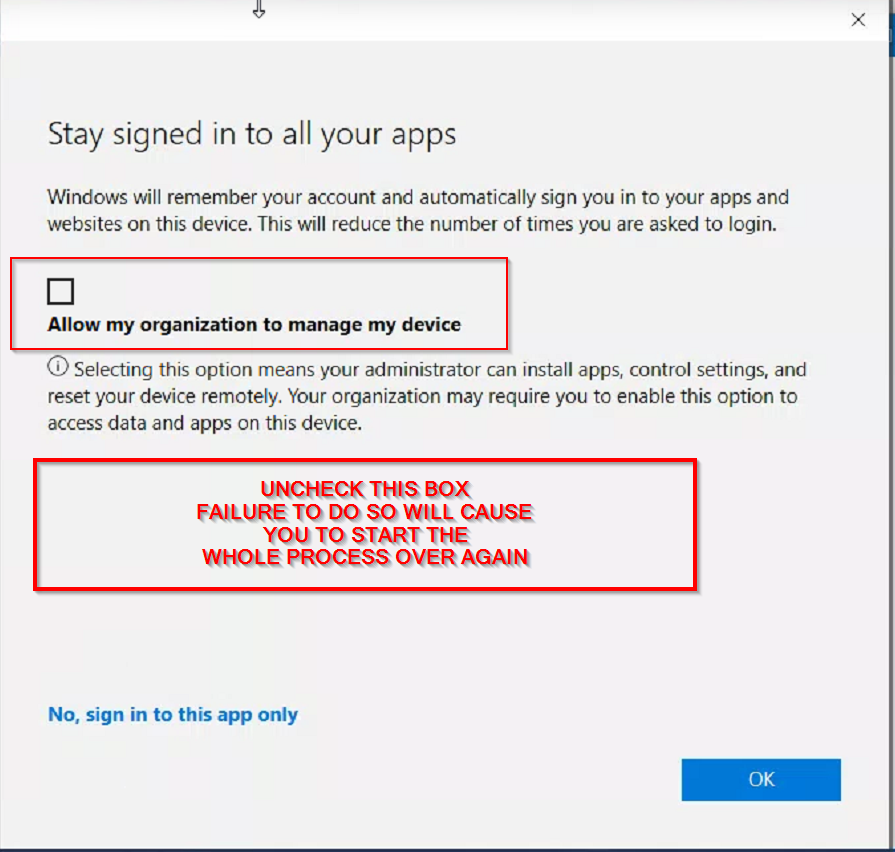
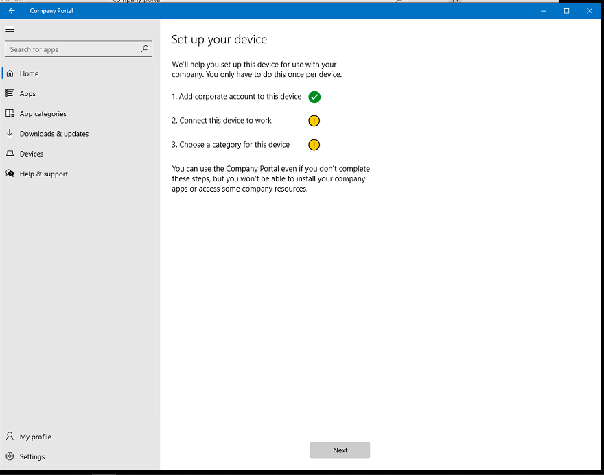
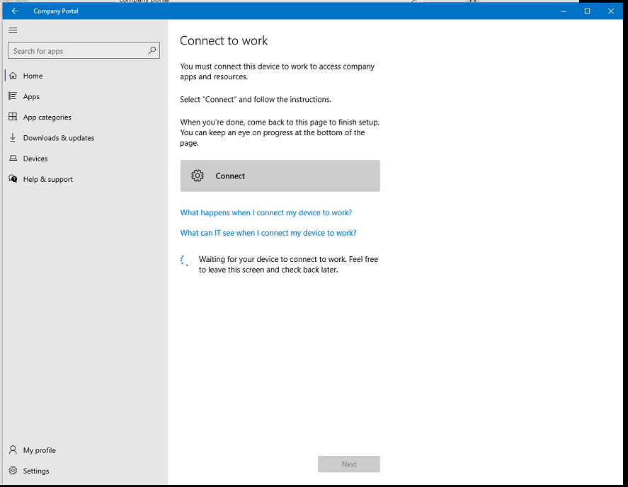
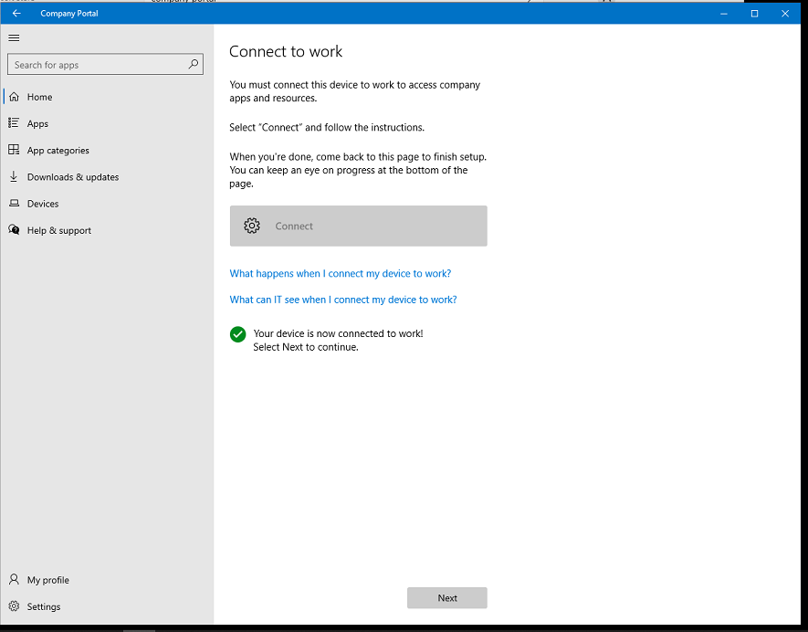
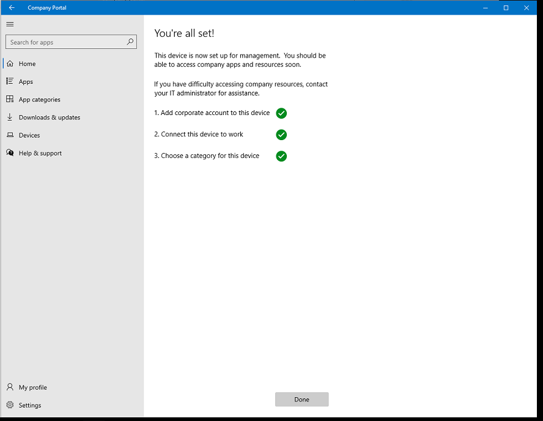

# Intune Troubleshooting

## Azure Hybrid Connect Device Pending

Use the [AzureHybridPendingFix.ps1](https://raw.githubusercontent.com/WFord26/PowerShell-Scripts/main/Intune/AzureHybridPendingFix.ps1?token=GHSAT0AAAAAAB3BC743NEBA27DHTFQHELYCY3OPGQQ) script when devices are stuck pending in Azure AD devices. After the device reboots the sync will take place the next time Azure AD sync runs. After which the device will be registered.

## Intune device will not register

Use the [ClearAADAccounts.ps1](https://raw.githubusercontent.com/WFord26/PowerShell-Scripts/main/Intune/ClearAADAccounts.ps1?token=GHSAT0AAAAAAB3BC743P7SGLO7TTHGMQOAGY3OPVDQ) script when devices are registered to Azure AD but are not coming into Intune. This can occur when the device has been registered under MAM policies and the Azure AAD tokens are still stored on the computer.  This PowerShell script deletes all AAD tokens from the device and reboots. This should allow the scheduled task that enrolls device in Intune to run. This will require users to re-enter their passwords for their Microsoft Apps to register again. 

## Devices that need to be brought into Intune with a Device Enrollment Manager (DEM) Account

Use the [IntuneDEMCleanUp.ps1](https://raw.githubusercontent.com/WFord26/PowerShell-Scripts/main/Intune/IntuneDEMCleanUp.ps1?token=GHSAT0AAAAAAB3BC743PKJCALAWKRLCEXOEY3OPYKQ) script to clean the device of and Azure AD connection and registry keys.

### Usage
1. Confirm the device is not registered in Azure devices or Hybrid joined, if it is delete the device or remove it from the Hybrid Joined OU and run an Azure AD Sync.
2. Run [IntuneDEMCleanUp.ps1](https://raw.githubusercontent.com/WFord26/PowerShell-Scripts/main/Intune/IntuneDEMCleanUp.ps1?token=GHSAT0AAAAAAB3BC743PKJCALAWKRLCEXOEY3OPYKQ) script.
3. Log into the computer as the DEM account once it reboots.
4. Once installed launch the application, and you will be prompted to login. Log in with the DEM account. Once you have entered in the credentials you will be asked if you want to "Allow my organization to manage my device" **UNCHECK THIS BOX**. Failure to do so will cause you to have to restart this entire process.

5. Once successful you will reach the following screen and select next.
 
6. Next, we will be prompted to Connect to work, click connect and enter in the DEM user and credentials. Once that is finished you will get a screen that states device is now connected.

7. This will complete the setup, the device should now be Azure AD joined and in Intune under the DEM account
