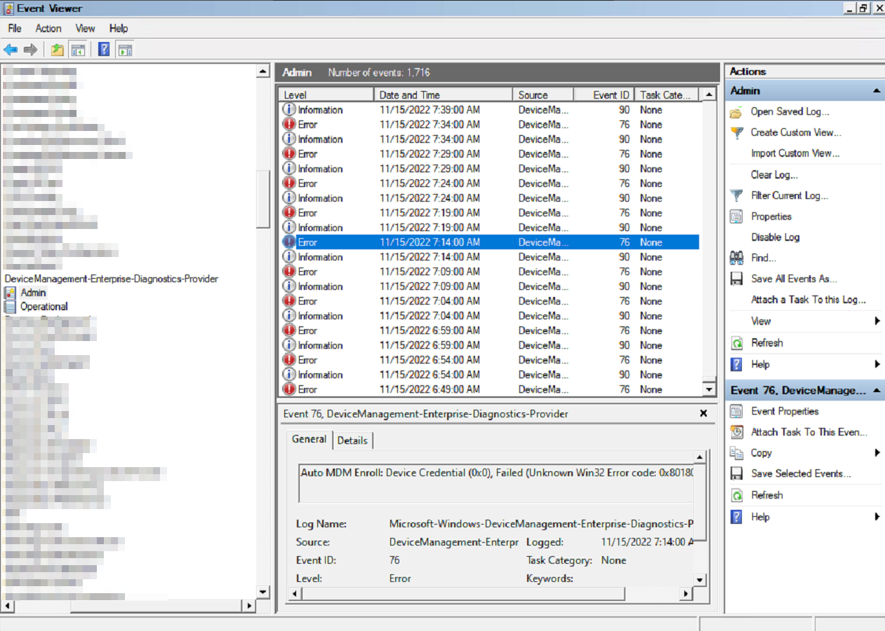
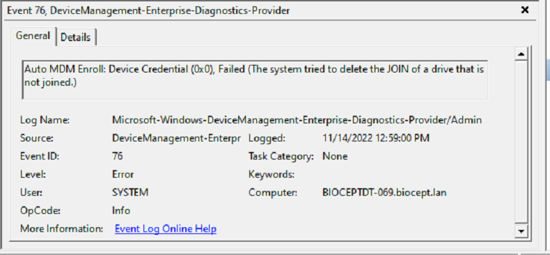
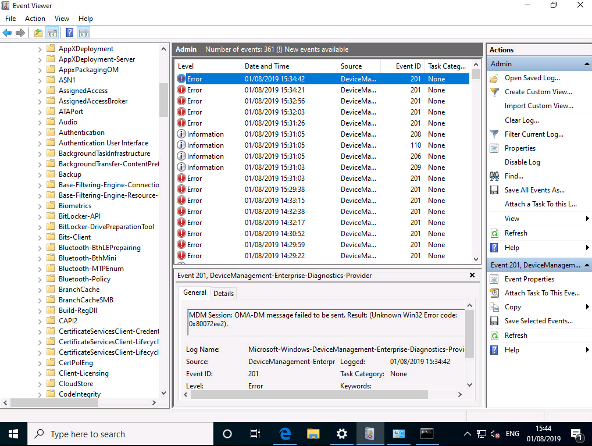

# Intune Troubleshooting

## Azure Hybrid Connect Device Pending

Use the [AzureHybridPendingFix.ps1](https://raw.githubusercontent.com/WFord26/PowerShell-Scripts/main/Intune/AzureHybridPendingFix.ps1?token=GHSAT0AAAAAAB3BC743NEBA27DHTFQHELYCY3OPGQQ) script when devices are stuck pending in Azure AD devices. After the device reboots the sync will take place the next time Azure AD sync runs. After which the device will be registered.

## Intune device will not register

This can be caused by a multitude of things. The best bet is to check on the affected computers logs through Event Viewer. 

>Event Viewer -> Applications and Services Logs -> Microsoft -> Windows -> DeviceManagement-Enterprise-Diagnostics-Provider -> Admin

### Error 76

1. Move the device out of the Azure AD synced OU and run a Delta Sync.
2. Run the command:
    > gpupdate /force

    on the device that is having issues to pull the new Group Policies and to delete the auto-enrollment process on login.
3. On the device run the script IntuneError76.ps1 on the device. 
4. While the device reboots. Move the device back in to the Azure AD synced OU and run a delta sync on the Azure AD sync.
5. Login to the computer as a user that has both a Azure AD premium license and Intune license as well. Run the command to sync Group policies.
     > gpupdate /force
6. You should soon see the device pending in Azure AD Devices and soon the device will enroll in to Intune.
7. To check on progress open Event Viewer. You should see Event ID 91 for device joined to Azure AD and Event ID 200 for joining Intune.

### Error 201

There are 2 types of errors I have encountered for event ID 201. 

**Win32 Error Code:0x80072ee2 (and variants)**

These are need to be corrected in the same manner as Error 76.

**401:Unauthorized**

This is a bit easier to fix. On the device run the script [IntuneFail201.ps1](https://raw.githubusercontent.com/WFord26/PowerShell-Scripts/main/Intune/IntuneFail201.ps1). Once complete the device will connect back to Azure AD and should register into Intune. Check Event Viewer to confirm.

## Devices that need to be brought into Intune with a Device Enrollment Manager (DEM) Account

Use the [IntuneDEMCleanUp.ps1](https://raw.githubusercontent.com/WFord26/PowerShell-Scripts/main/Intune/IntuneDEMCleanUp.ps1?token=GHSAT0AAAAAAB3BC743PKJCALAWKRLCEXOEY3OPYKQ) script to clean the device of and Azure AD connection and registry keys.

### Usage
1. Confirm the device is not registered in Azure devices or Hybrid joined, if it is delete the device or remove it from the Hybrid Joined OU and run an Azure AD Sync.
2. Run [IntuneDEMCleanUp.ps1](https://raw.githubusercontent.com/WFord26/PowerShell-Scripts/main/Intune/IntuneDEMCleanUp.ps1?token=GHSAT0AAAAAAB3BC743PKJCALAWKRLCEXOEY3OPYKQ) script.
3. Log into the computer as the DEM account once it reboots.
4. Once installed launch the application, and you will be prompted to login. Log in with the DEM account. Once you have entered in the credentials you will be asked if you want to "Allow my organization to manage my device" **UNCHECK THIS BOX**. Failure to do so will cause you to have to restart this entire process.

5. Once successful you will reach the following screen and select next.
 
6. Next, we will be prompted to Connect to work, click connect and enter in the DEM user and credentials. Once that is finished you will get a screen that states device is now connected.

7. This will complete the setup, the device should now be Azure AD joined and in Intune under the DEM account
