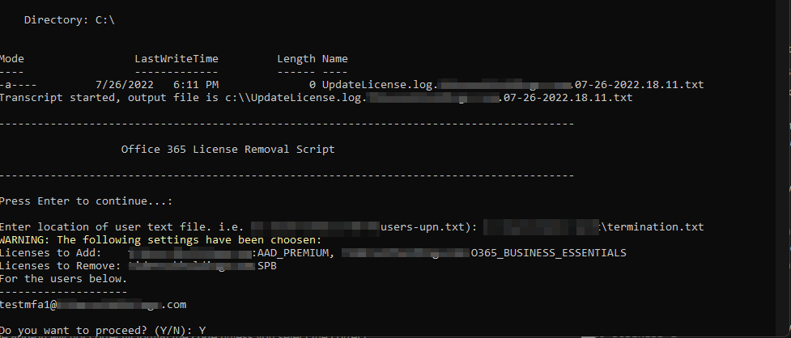

# Update License

Use this script to bulk Add, Remove, Swap licenses.

## Prep

1. Using the users.txt file that comes with the script create a list of all of the UPN's of the users that you would like to update. Save this file to your computer and copy the full file path i.e. (C:\Users\test\users.txt)

    >test1@contoso.com 
    >test2@contoso.com 
    >test3@contoso.com 
2. Launch PowerShell as adminstrator
3. Connect to MSOnline with a General Admin account for the tenant you wish to manage.
4. Run the following command to get a list of all licenses available in the tenant.
    >Get-MsolAccountSku

    
5. You can compare these to active licenses in [Office 365 Admin portal](https://admin.microsoft.com/) under **Billing->Licenses** you can view your subscriptions.
    
6. From here you can determine which license SKU matches up with the licenses you intend to make changes to. If you look at the pictures you can see the SKU Office 365 E3 license is ENTERPRISEPACK. This is an important step to make sure you are managing the correct licenses.

## Running the Script

The script allows you to run using your own choosen txt file instead of the default file users.txt. This can be accomplished by calling the parameter **-userFile**. 

**EXAMPLE**

  >.\UpdateLicenses.ps1 -userFile 'C:\Users\Will Work\termination.txt'
  >
  >Updates licenses from users in file located at 'C:\Users\Will Work\termination.txt'

In this option we will be removing the Business Premium License and adding the Business Standard and Azure AD P1.

### Steps

1. Change to the directory that you have the script in.
2. Run the script with or without the parameter added. The script will ask you to login if you are not already.
3. Once in you will be prompted with the Primary domain of the tenant you are connected to. This will allow you to proceed our not.

4. If you selected yes, the script will start by creating a log file located in your C: drive. The file will be called UpdateLicense.log.<companydomain>.<date/time>.txt

5. Hit enter to continue. You will then be prompted with a list of options of what you would like to do. 
   1. To Add licenses
   2. To Remove licences
   3. To Replace licenes
   4. Q To Quit

    
1. If your option was between 1-3 you will be prompted for license selection. (In this instance I will be going over a Add and Remove) 
2. Select the licenses that you would like to add to the accounts. 

8. Select the license/s that you would like to remove from the accounts.|

9. You will then have the ability to review the changes you are going to make and to which account you are making them too. 
    - Y to continue 
    - N to exit out of the script.

10. The script will finish and the log will be retrievable.  

